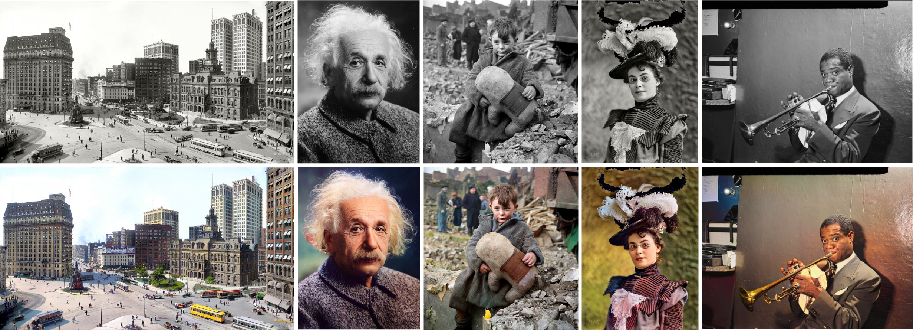

# 🎨 DDColor

Official PyTorch implementation of ICCV 2023 Paper "DDColor: Towards Photo-Realistic Image Colorization via Dual Decoders".


[](https://arxiv.org/abs/2212.11613)
[](https://huggingface.co/piddnad/DDColor-models)
[](https://www.modelscope.cn/models/damo/cv_ddcolor_image-colorization/summary)


> Xiaoyang Kang, Tao Yang, Wenqi Ouyang, Peiran Ren, Lingzhi Li, Xuansong Xie
>
> *DAMO Academy, Alibaba Group*

🪄 DDColor can provide vivid and natural colorization for historical black and white old photos.

<p align="center">
  
</p>

🎲 It can even colorize/recolor landscapes from anime games, transforming your animated scenery into a realistic real-life style! (Image source: Genshin Impact)

<p align="center">
  
</p>


## 🔥 News

* [2023-12-13] Release the DDColor-tiny.

* [2023-09-07] Add the model zoo.

* [2023-05-15] Code release for training and testing.

* [2023-05-05] The online demo is available.

## Online Demo

We provide [online demo](https://modelscope.cn/models/damo/cv_ddcolor_image-colorization/summary) via ModelScope. Feel free to try it out!

## Methods

*In short:* DDColor uses multi-scale visual features to optimize **learnable color tokens** (i.e. color queries) and achieves state-of-the-art performance on automatic image colorization.

<p align="center">
  
</p>


## Installation

### Requirements

- Python >= 3.7
- PyTorch >= 1.7

### Install with conda (Recommend)

```
conda create -n ddcolor python=3.8
conda activate ddcolor

pip install -r requirements.txt

python3 setup.py develop  # install basicsr
```

## Quick Start

### Inference with modelscope library

1. Install modelscope:

```
pip install "modelscope[cv]" -f https://modelscope.oss-cn-beijing.aliyuncs.com/releases/repo.html
```

2. Run the following codes:

```
import cv2
from modelscope.outputs import OutputKeys
from modelscope.pipelines import pipeline
from modelscope.utils.constant import Tasks

img_colorization = pipeline(Tasks.image_colorization, model='damo/cv_ddcolor_image-colorization')
result = img_colorization('https://modelscope.oss-cn-beijing.aliyuncs.com/test/images/audrey_hepburn.jpg')
cv2.imwrite('result.png', result[OutputKeys.OUTPUT_IMG])
```

It will automatically download the DDColor models.

You can find the model file `pytorch_model.pt` in the local path ~/.cache/modelscope/hub/damo.

### Inference from local script

1. Download the pretrained model file by simply running:

```
from modelscope.hub.snapshot_download import snapshot_download

model_dir = snapshot_download('damo/cv_ddcolor_image-colorization', cache_dir='./modelscope')
print('model assets saved to %s'%model_dir)
```

then the weights will be `modelscope/damo/cv_ddcolor_image-colorization/pytorch_model.pt`.

2. Run 
```
sh scripts/inference.sh
```

## Model Zoo

We provide several different versions of pretrained models, please check out [Model Zoo](MODEL_ZOO.md).


## Train

1. Dataset preparation: download [ImageNet](https://www.image-net.org/) dataset, or prepare any custom dataset of your own. Use the following script to get the dataset list file:

```
python data_list/get_meta_file.py
```

2. Download pretrained weights for [ConvNeXt](https://dl.fbaipublicfiles.com/convnext/convnext_large_22k_224.pth) and [InceptionV3](https://download.pytorch.org/models/inception_v3_google-1a9a5a14.pth) and put it into `pretrain` folder.

3. Specify 'meta_info_file' and other options in `options/train/train_ddcolor.yml`.

4. Run

```
sh scripts/train.sh
```

## Citation

If our work is helpful for your research, please consider citing:

```
@article{kang2022ddcolor,
  title={DDColor: Towards Photo-Realistic Image Colorization via Dual Decoders},
  author={Kang, Xiaoyang and Yang, Tao and Ouyang, Wenqi and Ren, Peiran and Li, Lingzhi and Xie, Xuansong},
  journal={arXiv preprint arXiv:2212.11613},
  year={2022}
}
```

## License
© Alibaba, 2023. For academic and non-commercial use only.

## Acknowledgments
We thank the authors of BasicSR for the awesome training pipeline.

> Xintao Wang, Ke Yu, Kelvin C.K. Chan, Chao Dong and Chen Change Loy. BasicSR: Open Source Image and Video Restoration Toolbox. https://github.com/xinntao/BasicSR, 2020.

Some codes are adapted from [ColorFormer](https://github.com/jixiaozhong/ColorFormer), [BigColor](https://github.com/KIMGEONUNG/BigColor), [ConvNeXt](https://github.com/facebookresearch/ConvNeXt), [Mask2Former](https://github.com/facebookresearch/Mask2Former), and [DETR](https://github.com/facebookresearch/detr). Thanks for their excellent work!
