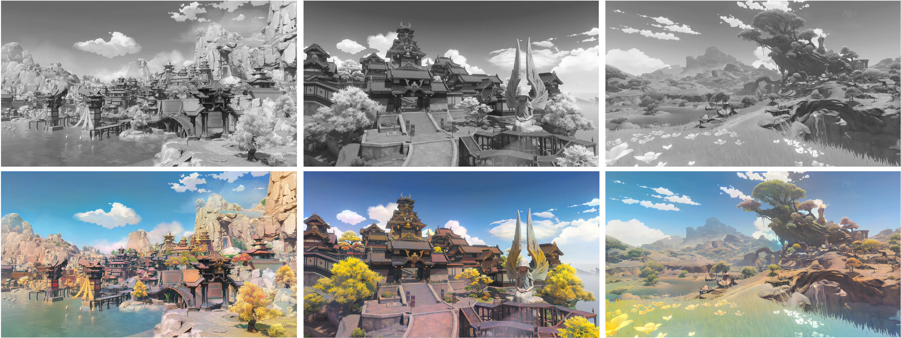
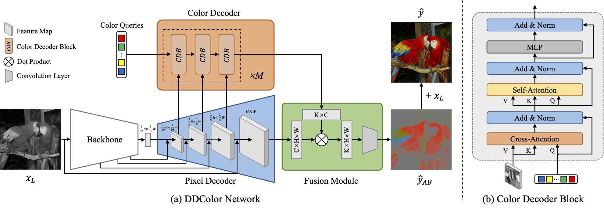

# 🎨 DDColor
[](https://arxiv.org/abs/2212.11613)
[](https://huggingface.co/piddnad/DDColor-models)
[](https://www.modelscope.cn/models/damo/cv_ddcolor_image-colorization/summary)
[](https://replicate.com/piddnad/ddcolor)


Official PyTorch implementation of ICCV 2023 Paper "DDColor: Towards Photo-Realistic Image Colorization via Dual Decoders".

> Xiaoyang Kang, Tao Yang, Wenqi Ouyang, Peiran Ren, Lingzhi Li, Xuansong Xie  
> *DAMO Academy, Alibaba Group*

🪄 DDColor can provide vivid and natural colorization for historical black and white old photos.

<p align="center">
  
</p>

🎲 It can even colorize/recolor landscapes from anime games, transforming your animated scenery into a realistic real-life style! (Image source: Genshin Impact)

<p align="center">
  
</p>


## News
- [2024-01-28] Support inference via 🤗 Hugging Face! Thanks @[Niels](https://github.com/NielsRogge) for the suggestion and example code and @[Skwara](https://github.com/Skwarson96) for fixing bug.
- [2024-01-18] Add Replicate demo and API! Thanks @[Chenxi](https://github.com/chenxwh).
- [2023-12-13] Release the DDColor-tiny pre-trained model!
- [2023-09-07] Add the Model Zoo and release three pretrained models!
- [2023-05-15] Code release for training and inference!
- [2023-05-05] The online demo is available!


## Online Demo
Try our online demos at [ModelScope](https://www.modelscope.cn/models/damo/cv_ddcolor_image-colorization/summary) and [Replicate](https://replicate.com/piddnad/ddcolor).


## Methods
*In short:* DDColor uses multi-scale visual features to optimize **learnable color tokens** (i.e. color queries) and achieves state-of-the-art performance on automatic image colorization.

<p align="center">
  
</p>


## Installation
### Requirements
- Python >= 3.7
- PyTorch >= 1.7

### Installation with conda (recommended)

```sh
conda create -n ddcolor python=3.9
conda activate ddcolor
pip install torch==2.2.0 torchvision==0.17.0 torchaudio==2.2.0 --index-url https://download.pytorch.org/whl/cu118

pip install -r requirements.txt

# Install basicsr, only required for training
python3 setup.py develop  
```

## Quick Start
### Inference Using Local Script (No `basicsr` Required)
1. Download the pretrained model:

```python
from modelscope.hub.snapshot_download import snapshot_download

model_dir = snapshot_download('damo/cv_ddcolor_image-colorization', cache_dir='./modelscope')
print('model assets saved to %s' % model_dir)
```

2.	Run inference with

```sh
python infer.py --model_path ./modelscope/damo/cv_ddcolor_image-colorization/pytorch_model.pt --input ./assets/test_images
```
or
```sh
sh scripts/inference.sh
```

### Inference Using Hugging Face 
Load the model via Hugging Face Hub:

```python
from infer_hf import DDColorHF

ddcolor_paper_tiny = DDColorHF.from_pretrained("piddnad/ddcolor_paper_tiny")
ddcolor_paper      = DDColorHF.from_pretrained("piddnad/ddcolor_paper")
ddcolor_modelscope = DDColorHF.from_pretrained("piddnad/ddcolor_modelscope")
ddcolor_artistic   = DDColorHF.from_pretrained("piddnad/ddcolor_artistic")
```

Check `infer_hf.py` for the details of the inference, or directly perform model inference by running:

```sh
python infer_hf.py --model_name ddcolor_modelscope --input ./assets/test_images
# model_name: [ddcolor_paper | ddcolor_modelscope | ddcolor_artistic | ddcolor_paper_tiny]
```

### Inference Using ModelScope
1. Install modelscope:

```sh
pip install modelscope
```

2. Run inference:

```python
import cv2
from modelscope.outputs import OutputKeys
from modelscope.pipelines import pipeline
from modelscope.utils.constant import Tasks

img_colorization = pipeline(Tasks.image_colorization, model='damo/cv_ddcolor_image-colorization')
result = img_colorization('https://modelscope.oss-cn-beijing.aliyuncs.com/test/images/audrey_hepburn.jpg')
cv2.imwrite('result.png', result[OutputKeys.OUTPUT_IMG])
```

This code will automatically download the `ddcolor_modelscope` model (see [ModelZoo](#model-zoo)) and performs inference. The model file `pytorch_model.pt` can be found in the local path `~/.cache/modelscope/hub/damo`.

### Gradio Demo
Install the gradio and other required libraries:

```sh
pip install gradio gradio_imageslider timm
```

Then, you can run the demo with the following command:

```sh
python gradio_app.py
```

## Model Zoo
We provide several different versions of pretrained models, please check out [Model Zoo](MODEL_ZOO.md).


## Train
1. Dataset Preparation: Download the [ImageNet](https://www.image-net.org/) dataset or create a custom dataset. Use this script to obtain the dataset list file:

```sh
python data_list/get_meta_file.py
```

2. Download the pretrained weights for [ConvNeXt](https://dl.fbaipublicfiles.com/convnext/convnext_large_22k_224.pth) and [InceptionV3](https://download.pytorch.org/models/inception_v3_google-1a9a5a14.pth) and place them in the `pretrain` folder.

3. Specify 'meta_info_file' and other options in `options/train/train_ddcolor.yml`.

4. Start training:

```sh
sh scripts/train.sh
```

## ONNX export
Support for ONNX model exports is available.

1.	Install dependencies:

```sh
pip install onnx==1.16.1 onnxruntime==1.19.2 onnxsim==0.4.36
```

2. Usage example:

```sh
python export.py
usage: export.py [-h] [--input_size INPUT_SIZE] [--batch_size BATCH_SIZE] --model_path MODEL_PATH [--model_size MODEL_SIZE] 
[--decoder_type DECODER_TYPE] [--export_path EXPORT_PATH] [--opset OPSET]
```

Demo of ONNX export using a `ddcolor_paper_tiny` model is available [here](notebooks/colorization_pipeline_onnxruntime.ipynb).


## Citation

If our work is helpful for your research, please consider citing:

```
@inproceedings{kang2023ddcolor,
  title={DDColor: Towards Photo-Realistic Image Colorization via Dual Decoders},
  author={Kang, Xiaoyang and Yang, Tao and Ouyang, Wenqi and Ren, Peiran and Li, Lingzhi and Xie, Xuansong},
  booktitle={Proceedings of the IEEE/CVF International Conference on Computer Vision},
  pages={328--338},
  year={2023}
}
```

## Acknowledgments
We thank the authors of BasicSR for the awesome training pipeline.

> Xintao Wang, Ke Yu, Kelvin C.K. Chan, Chao Dong and Chen Change Loy. BasicSR: Open Source Image and Video Restoration Toolbox. https://github.com/xinntao/BasicSR, 2020.

Some codes are adapted from [ColorFormer](https://github.com/jixiaozhong/ColorFormer), [BigColor](https://github.com/KIMGEONUNG/BigColor), [ConvNeXt](https://github.com/facebookresearch/ConvNeXt), [Mask2Former](https://github.com/facebookresearch/Mask2Former), and [DETR](https://github.com/facebookresearch/detr). Thanks for their excellent work!
